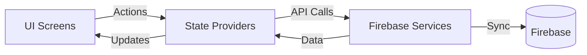

# Project Architecture

This document describes the high-level architecture of ShopEase, including state management, data flow, and external integrations.

## 🏛️ Overall Pattern

ShopEase follows a modular architecture where UI components are separated from business logic and data services. This ensures maintainability and scalability.

## 📦 State Management

The project uses the [Provider](https://pub.dev/packages/provider) package for state management. This follows the **ChangeNotifier** pattern:

1.  **Providers**: Specialized classes that extend `ChangeNotifier` to hold application state and notify listeners when data changes.
    - `CartProvider`: Manages the items in the shopping cart and calculates totals.
    - `FavoritesProvider`: Manages the user's wishlist and handles toggle logic.
2.  **Consumers/Watchers**: UI widgets that listen for changes in the providers and rebuild automatically.
    - `context.watch<T>()`: Rebuilds when the state changes.
    - `context.read<T>()`: Accesses the state without rebuilding (e.g., for calling methods).

## ☁️ Backend & Data Layer

ShopEase leverages **Firebase** for its backend requirements:

- **Authentication**: `FirebaseAuth` handles user sign-in/sign-up. The `AuthService` class abstracts these operations into simple methods.
- **Database**: `Cloud Firestore` is used for storing product information, user profiles, and order history.
- **Storage**: `Firebase Storage` hosts product images and user-uploaded content.
- **Persistence**: `SharedPreferences` is used for light local storage, such as tracking if it's the user's first time opening the app.

## 🔄 Data Flow

1.  **User Action**: A user interacts with the UI (e.g., clicks "Add to Cart").
2.  **Method Call**: The UI calls a method on the relevant `Provider`.
3.  **Service Interaction**: The `Provider` interacts with a `Service` (if needed, e.g., to persist to Firestore).
4.  **State Update**: The `Provider` updates its internal state and calls `notifyListeners()`.
5.  **UI Refresh**: All widgets listening to that `Provider` rebuild with the new data.

## 🎨 UI & Styling

The application uses **Material Design 3** as its base styling. Customizations are handled through:
- `ThemeData`: Global theme configuration in `main.dart`.
- **Lato Font**: Applied globally for a modern, clean look.
- **Color Palettes**: Primary and secondary colors derived from the brand's seed color.
